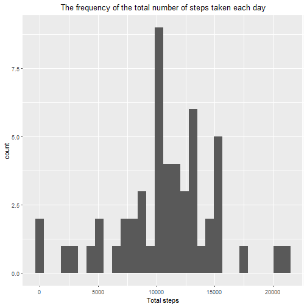
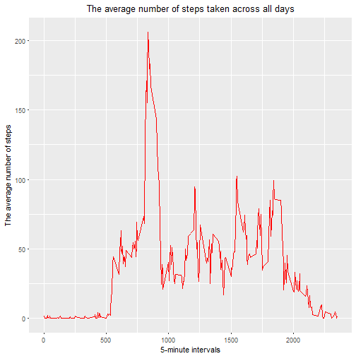
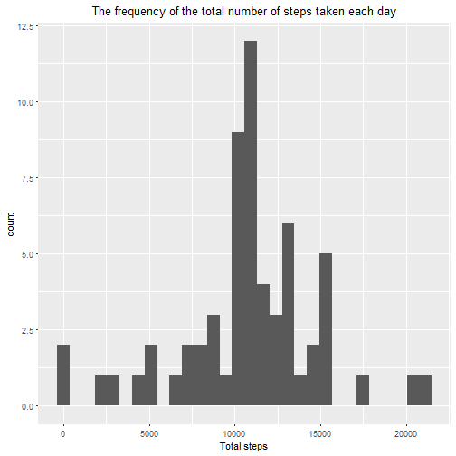
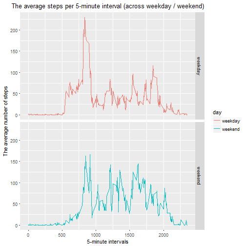

# **Loading and preprocessing the data**
### *Code for reading in the dataset and/or processing the data*


```r
# 1. Loading data into R
rawData <- read.csv("activity.csv")
head(rawData)
```

```
##   steps       date interval
## 1    NA 2012-10-01        0
## 2    NA 2012-10-01        5
## 3    NA 2012-10-01       10
## 4    NA 2012-10-01       15
## 5    NA 2012-10-01       20
## 6    NA 2012-10-01       25
```


```r
# 2. Process/transform the data 
str(rawData)
```

```
## 'data.frame':	17568 obs. of  3 variables:
##  $ steps   : int  NA NA NA NA NA NA NA NA NA NA ...
##  $ date    : Factor w/ 61 levels "2012-10-01","2012-10-02",..: 1 1 1 1 1 1 1 1 1 1 ...
##  $ interval: int  0 5 10 15 20 25 30 35 40 45 ...
```

```r
summary(rawData)
```

```
##      steps                date          interval     
##  Min.   :  0.00   2012-10-01:  288   Min.   :   0.0  
##  1st Qu.:  0.00   2012-10-02:  288   1st Qu.: 588.8  
##  Median :  0.00   2012-10-03:  288   Median :1177.5  
##  Mean   : 37.38   2012-10-04:  288   Mean   :1177.5  
##  3rd Qu.: 12.00   2012-10-05:  288   3rd Qu.:1766.2  
##  Max.   :806.00   2012-10-06:  288   Max.   :2355.0  
##  NA's   :2304     (Other)   :15840
```

```r
# Ignore the missing values in the dataset.
tidyData <- rawData[complete.cases(rawData),]
head(tidyData)
```

```
##     steps       date interval
## 289     0 2012-10-02        0
## 290     0 2012-10-02        5
## 291     0 2012-10-02       10
## 292     0 2012-10-02       15
## 293     0 2012-10-02       20
## 294     0 2012-10-02       25
```

```r
tail(tidyData)
```

```
##       steps       date interval
## 17275     0 2012-11-29     2330
## 17276     0 2012-11-29     2335
## 17277     0 2012-11-29     2340
## 17278     0 2012-11-29     2345
## 17279     0 2012-11-29     2350
## 17280     0 2012-11-29     2355
```

```r
# Convert the values of date column to object of class "Date"

class(tidyData$date)
```

```
## [1] "factor"
```

```r
tidyData$date<-as.Date(tidyData$date,"%Y-%m-%d")
class(tidyData$date)
```

```
## [1] "Date"
```

# **What is mean total number of steps taken per day?**

###  *Histogram of the total number of steps taken each day*

```r
# 1. Calculate the total number of steps taken per day
# I renamed the column 'steps' to 'totalSteps'to reflect to true meaning of the values
totalStepsPerDay<-setNames(aggregate(steps~date,tidyData,sum),c("date","totalSteps"))

# 2. Make a histogram of the total number of steps taken each day
library(ggplot2)
ggplot(totalStepsPerDay,aes(x=date))+
        geom_histogram(aes(totalSteps),bins = 30)+
        labs(title="The frequency of the total number of steps taken each day",x="Total steps")+
        theme(plot.title = element_text(hjust=0.5))
```



### *Mean and median number of steps taken each day*

```r
# 3.Calculate and report the mean and median of the total number of steps taken per day
meanSteps<-round(mean(totalStepsPerDay$totalSteps),digits = 2)
medianSteps<-median(totalStepsPerDay$totalSteps)
```

*The mean of the total number of steps taken per day is **1.076619 &times; 10<sup>4</sup>**.*   
*The median of the total number of steps taken per day is **10765**.*

# **What is the average daily activity pattern?**
### *Time series plot of the average number of steps taken*

```r
# 1. Make a time series plot (i.e. type = "l") of the 5-minute interval (x-axis) 
# and the average number of steps taken, averaged across all days (y-axis)


# I renamed the column 'steps' to 'meanSteps'to reflect to true meaning of the values 
aveStepInterval<-setNames(aggregate(steps~interval,tidyData,mean),c("interval","meanSteps"))

ggplot(aveStepInterval,aes(interval,meanSteps), show.legend=F)+
        geom_line(color="red")+
        labs(x="5-minute intervals", y="The average number of steps",title="The average number of steps taken across all days")+
        theme(plot.title=element_text(hjust = 0.5))
```



### *The 5-minute interval that, on average, contains the maximum number of steps*

```r
# 2. Which 5-minute interval, on average across all the days in the dataset, contains the maximum number of steps?

maxStepInterval<-aveStepInterval[aveStepInterval$meanSteps==max(aveStepInterval$meanSteps),"interval"]
```
*The 5-minute interval that on average across all the days contains the maximum number of steps is **835**.*

# **Imputing missing values**
### *Code to describe and show a strategy for imputing missing data*

```r
# 1. Calculate and report the total number of missing values in the dataset (i.e. the total number of rows with NAs)
naRows<-sum(!complete.cases(rawData))
```

*The total number of missing values in the dataset is **2304**.*

I am using the mean for that 5-minute interval as the strategy for filling in all of the missing values in the dataset.


```r
# 3. Create a new dataset that is equal to the original dataset but with the missing data filled in.
filled_df<- rawData
filled_df<-merge(filled_df,aveStepInterval,by="interval")
filled_df$steps[is.na(filled_df$steps)]<-filled_df$meanSteps[is.na(filled_df$steps)]
```

### *Histogram of the total number of steps taken each day after missing values are imputed*


```r
# 4. Make a histogram of the total number of steps taken each day and Calculate and report the mean and median total number of steps taken per day. Do these values differ from the estimates from the first part of the assignment? What is the impact of imputing missing data on the estimates of the total daily number of steps?

# I renamed the column 'steps' to 'totalSteps'to reflect to true meaning of the values
totalStepsFilledData<-setNames(aggregate(steps~date,filled_df,sum),c("date","totalSteps"))

ggplot(totalStepsFilledData)+
        geom_histogram(aes(totalSteps), bins=30)+
        labs(title="The frequency of the total number of steps taken each day",x="Total steps")+
        theme(plot.title = element_text(hjust=0.5))
```



```r
# Calculate and report the mean and median total number of steps taken per day
meanStepFilled<-round(mean(totalStepsPerDay$totalSteps), digits = 2)
medianStepFilled<-median(totalStepsPerDay$totalSteps)
```

*The mean of the total number of steps taken per day is **1.076619 &times; 10<sup>4</sup>** (Excluding missing values)*  
*The mean of the total number of steps taken per day is **1.076619 &times; 10<sup>4</sup>** (Imputing missing values).*  
*The median of the total number of steps taken per day is **10765** (Excluding missing values).*  
*The median of the total number of steps taken per day is **10765** (Imputing missing values).*  

# **Are there differences in activity patterns between weekdays and weekends?**
### *Panel plot comparing the average number of steps taken per 5-minute interval across weekdays and weekends*

```r
# 1. Create a new factor variable in the dataset with two levels – “weekday” and “weekend” indicating whether a given date is a weekday or weekend day.

filled_df$date<-as.Date(filled_df$date,"%Y-%m-%d")
weekend<-c("Saturday","Sunday")
weekday<-c("Monday","Tuesday", "Wednesday","Thursday","Friday")
filled_df$day<- ifelse(weekdays(filled_df$date) %in% weekday,"weekday","weekend")
filled_df$day<-as.factor(filled_df$day)


head(filled_df)
```

```
##   interval    steps       date meanSteps     day
## 1        0 1.716981 2012-10-01  1.716981 weekday
## 2        0 0.000000 2012-11-23  1.716981 weekday
## 3        0 0.000000 2012-10-28  1.716981 weekend
## 4        0 0.000000 2012-11-06  1.716981 weekday
## 5        0 0.000000 2012-11-24  1.716981 weekend
## 6        0 0.000000 2012-11-15  1.716981 weekday
```

```r
# 2.Make a panel plot containing a time series plot (i.e. type = "l") of the 5-minute interval (x-axis) and the average number of steps taken, averaged across all weekday days or weekend days (y-axis)

meanWeek<-aggregate(steps~interval+day, data=filled_df, mean)
ggplot(meanWeek,aes(x=interval, y=steps))+
        geom_line(aes(color=day))+
        facet_grid(day ~ .)+
        labs(title= "The average steps per 5-minute interval (across weekday / weekend)",x="5-minute intervals", y="The average number of steps")+
        theme(plot.title = element_text(hjust=0.5))
```




